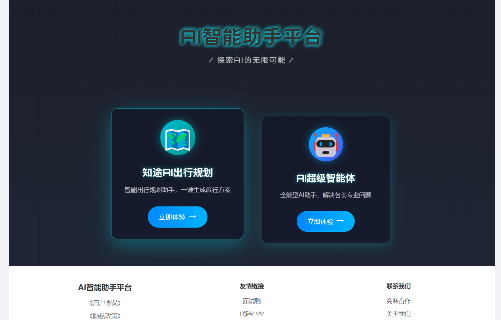
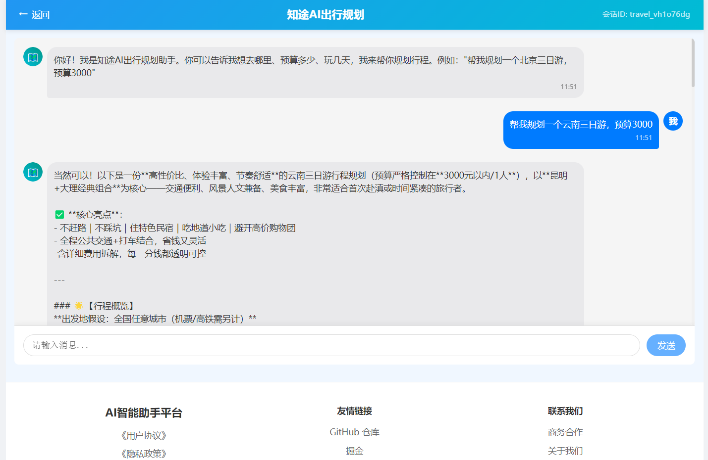

<p align="center">
  
</p>

<h1 align="center">云途智行 AI 出行系统</h1>

<p align="center">
  <strong>基于 Spring Boot 3 + Spring AI + Vue3 的智能出行规划平台</strong>
</p>

<p align="center">
  
  
  
  
  
</p>

---

## 📸 效果预览

> 🖼️ 截图待添加 — 项目启动后截图放入 `docs/images/` 目录

| 对话页面 | 行程规划结果 |
|:---:|:---:|
|  |  |

---

## 🚀 项目介绍

云途智行 AI 出行系统是一个基于大语言模型的**智能出行规划助手**。用户输入目的地和预算后，AI 通过 **ReAct** 模式自主完成需求分析、联网搜索景点/天气/交通信息、综合规划并生成行程方案文档。

> 适用于旅游规划、行程推荐、出行咨询等场景，可作为 AI Agent 学习实践的完整参考项目。

---

## ✨ 核心功能

| 功能 | 说明 |
|------|------|
| 🧠 **AI 行程规划** | 输入目的地 + 预算，AI 自动生成完整行程方案 |
| 🌐 **多工具调用** | WebSearch、WebScraping、PDF 导出等 7 种内置工具 |
| 📚 **RAG 知识库问答** | PGVector 向量库 + 旅游攻略知识库，精准推荐景点 |
| ⚡ **SSE 流式输出** | 对话结果实时推送，交互流畅 |
| 🔗 **MCP 协议支持** | 可扩展自定义工具服务，灵活集成 |
| 💾 **Redis 缓存** | 缓存对话上下文，减少大模型重复调用 |

### AI Agent 架构

```
用户输入 → ReAct Agent(思考→行动→观察) → 工具调用 → 结果生成
                ↓                              ↑
           RAG 知识库检索 ←——— PGVector ————→ 向量存储
```

---

## 🏗️ 技术栈

| 层级 | 技术 | 用途 |
|------|------|------|
| **后端** | Java 21 + Spring Boot 3 | 应用框架 |
| **AI 框架** | Spring AI 1.0 + DashScope | AI 集成、大模型调用 |
| **智能体** | ReAct Agent | 自主决策与工具编排 |
| **向量库** | PostgreSQL + PGVector | RAG 知识库存储与检索 |
| **缓存** | Redis | 对话上下文缓存 |
| **前端** | Vue 3 | 用户交互界面 |
| **部署** | Docker | 容器化交付 |

---

## 📁 项目结构

```
yuntu-ai-travel/
├── zhitu-travel-frontend/            # Vue3 前端
│   ├── src/
│   │   ├── components/               # 通用组件
│   │   ├── views/                    # 页面视图
│   │   └── api/                      # 接口封装
│   └── ...
└── src/main/java/com/zhitu/travel/
    ├── agent/                        # AI 智能体（核心）
    │   ├── BaseAgent                 # 基础智能体
    │   ├── ToolCallAgent             # 工具调用智能体
    │   ├── ReActAgent                # ReAct 模式智能体
    │   └── TravelPlannerAgent        # 出行规划智能体
    ├── rag/                          # RAG 全链路
    │   ├── DocumentLoader            # 文档加载
    │   ├── VectorStore               # 向量存储
    │   └── QueryAugmenter            # 查询增强
    ├── tools/                        # 7 种内置工具
    ├── controller/                   # REST API
    ├── service/                      # 业务服务层
    ├── chatmemory/                   # 对话记忆
    ├── config/                       # 全局配置
    └── advisor/                      # 自定义 Advisor
```

---

## 🛠️ 快速启动

### 环境要求

- JDK 21+
- Node.js 18+
- Maven 3.6+
- PostgreSQL 14+（可选，不使用 RAG 时可跳过）
- Redis（可选）

### 1️⃣ 配置 API Key

修改 `src/main/resources/application.yml`，填入阿里云百炼 DashScope API Key：

```yaml
spring:
  ai:
    dashscope:
      api-key: your-api-key-here
```

### 2️⃣ 启动后端

```bash
mvn spring-boot:run
```

### 3️⃣ 启动前端

```bash
cd zhitu-travel-frontend
npm install
npm run dev
```

### 4️⃣ 访问

浏览器打开 `http://localhost:5173` 即可使用。

### Docker 部署

```bash
docker-compose up -d
```

---

## 🧪 测试

```bash
mvn test
```

测试覆盖了智能体对话、RAG 检索、工具调用等核心链路。

---

## 📊 项目亮点（面试用）

- ✅ **完整的 AI Agent 实现** — 从 BaseAgent 到 ReActAgent 的清晰继承链
- ✅ **RAG 全链路落地** — 文档加载 → 向量化 → 检索 → 查询增强
- ✅ **7 种可扩展工具** — 展示工具调用设计模式
- ✅ **MCP 协议集成** — 走在 AI 工程化前沿
- ✅ **生产级工程规范** — 分层架构、异常处理、Docker 部署

---

## 📄 许可证

[MIT](LICENSE)
